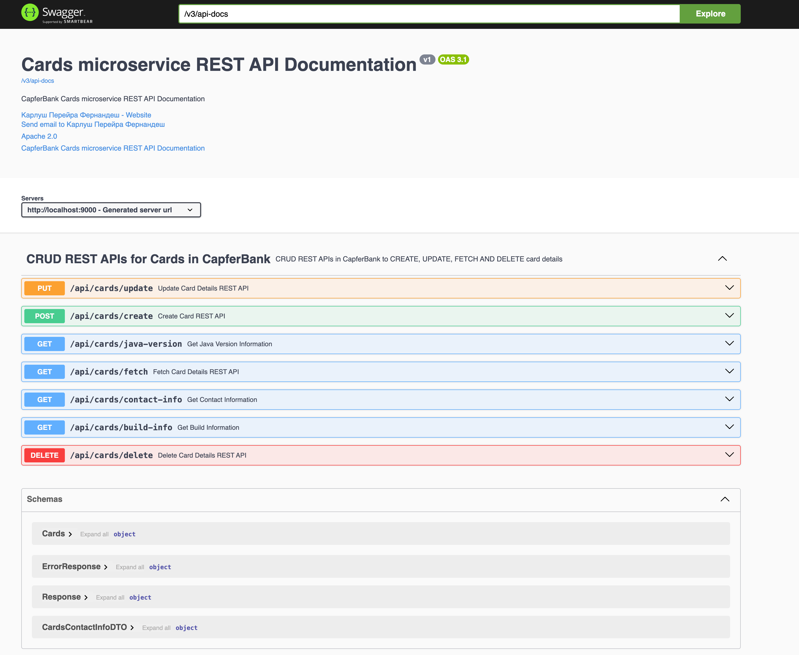
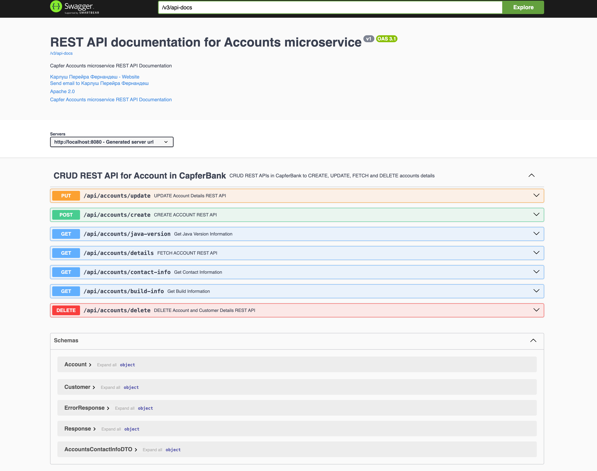
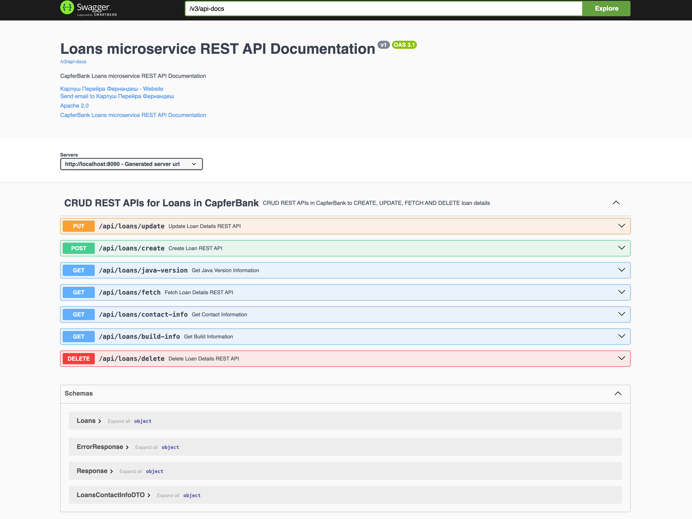

В этом репозитории собраны несколько проектов, над которыми я работаю,
пока ищу работу на позицию Java-разработчика.
Спасибо, что нашли время ознакомиться с ними. Приятного просмотра!

**Микросервис банковского счёта** — бэкенд api на Java и Spring Boot с использованием современных практик разработки и контейнеризации.

🛠 Стек Технологий

Основные технологии

* Язык: Java 21
* Фреймворк: Spring Boot 3.x, Spring Cloud (Starter Bus AMQP, Cloud Config Monitor)
* Контейнеризация: Docker, Docker Compose
* Google Container Tools (jib) - для создания оптимизированных образов Docker и OCI для Java приложений 
* Hookdeck: Для тестирования вебхука GitHub.
* Базы данных: PostgreSQL
* ORM: Spring Data JPA (Hibernate)
* API Документация: OpenAPI 3 (Swagger UI)
* Spring Cloud Eureka Server - запланировано
* Spring Cloud Gateway - запланировано
* Grafana, Open Telemetry, Prometheus - запланировано
* Аутентификация: OAuth - запланировано
* Кеширование: Spring Data Redis - запланировано
* Kubernetes orchestration - запланировано
* Helm - запланировано

Тестирование

* JUnit 5, Mockito - запланировано
* Spring MVC Test - запланировано
* Testcontainers (интеграционное тестирование БД) - запланировано

Сервисы

* Account Service - управление банковским счетом
* Cards Service - Управление картами.
* Loans Service - Управление кредитами.
* Config Service - Управление конфигурации

🚀 Запуск проекта

Предварительные требования

* JDK 21 (17+ должно быть достаточно - но не проверил)
* Docker 20.10+
* Docker Compose 2.4+
* Gradle 8.14+
* GIT 2.51+

**Локальный запуск через Docker Compose**
1. Клонируйте репозиторий:
   `git clone https://github.com/capfer27/spring-boot-microservices.git`
2. `cd docker-compose && prod `
3. Запустите все сервисы:
   `docker-compose up -d --build`

   - Эта команда создаст общий контейнер PostgreSQL для всех сервисов и запустит все микросервисы в отдельных контейнерах:
        * Accounts Service
        * Cards Service
        * Loans Service
        * Config Service

4. Остановка сервисов: `docker-compose down`

5. В SWAGGER UI сервисы будут доступны по адресам:
     - Cards microservice URI: http://localhost:9000/swagger-ui/index.html#/
     - Accounts microservice URI: http://localhost:8080/swagger-ui/index.html#/
     - Loans microservice URI: http://localhost:8090/swagger-ui/index.html#/

**Скриншоты Rest UIs**
 - Cards:
  

 - Accounts:
    

 - Loans: 
    